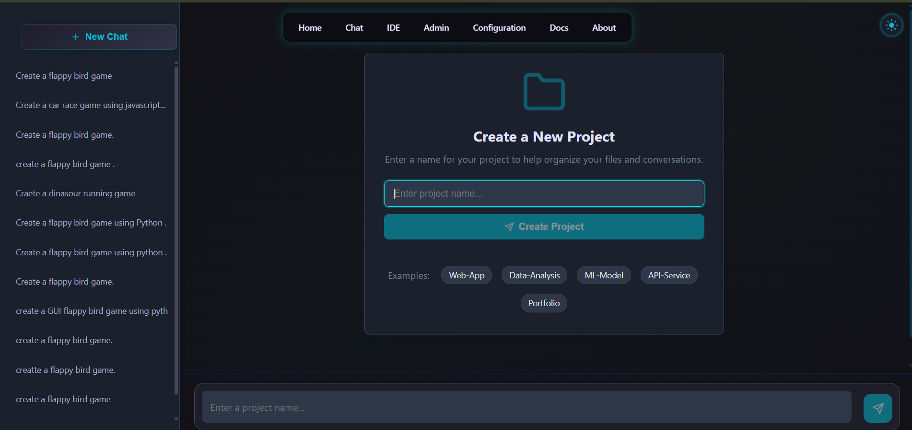
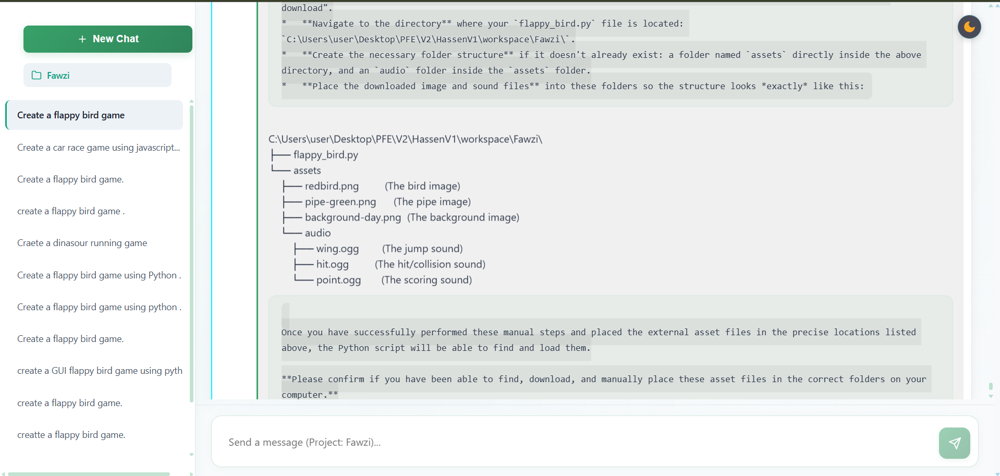
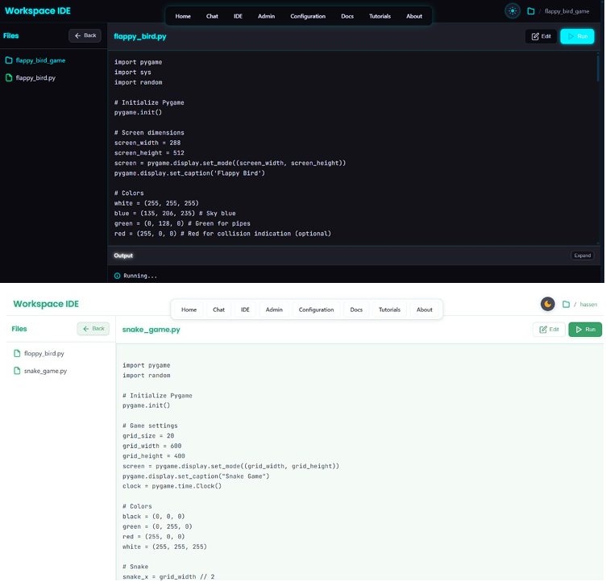
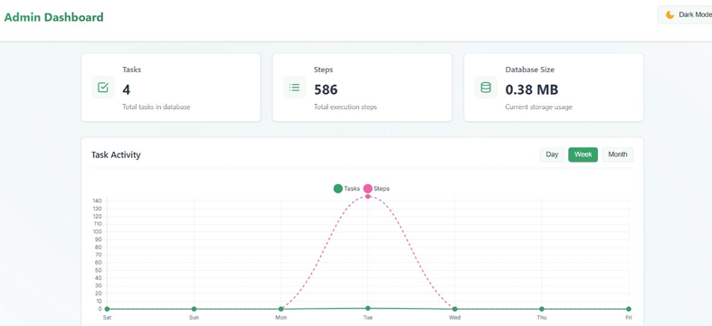
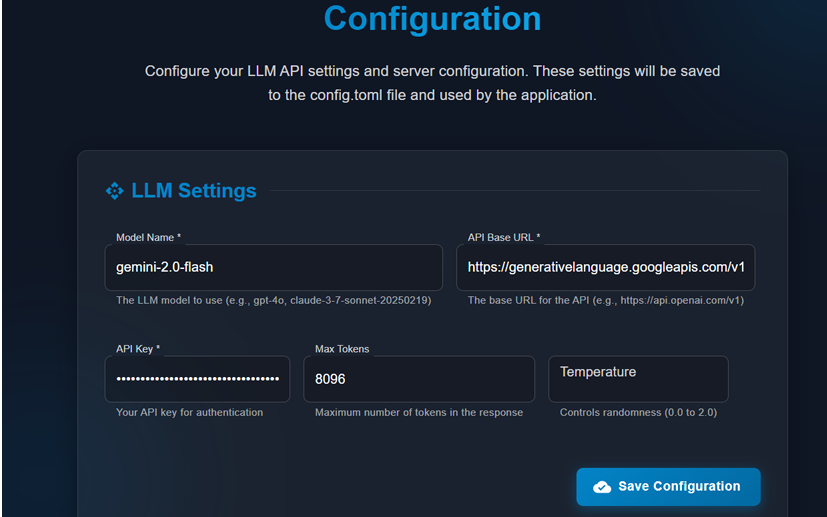
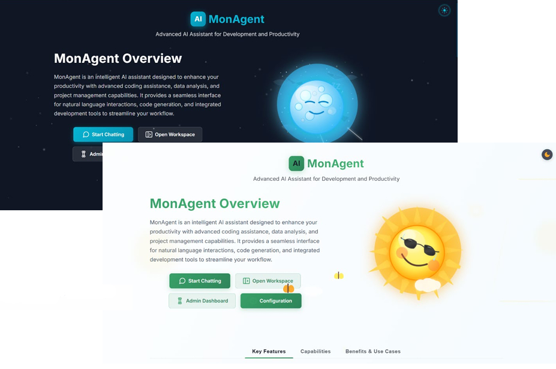

# AI Assistant with Web Interface - MonAgent

An autonomous AI agent system capable of planning, executing code, and interacting with tools to solve complex tasks. The project combines a powerful FastAPI backend with a modern React interface for a seamless user experience.

## � Problem Statement & Solution

### The Challenge

Developers and users often struggle with complex, multi-step tasks that require switching between code writing, command-line execution, and web research. Traditional chatbots are limited to text generation and lack the ability to **actively execute** the solutions they propose, leading to a disjointed workflow where the user must manual copy-paste code and run commands.

### The Solution: MonAgent

We built MonAgent to bridge this gap by creating an **autonomous agent** that can "Think" and "Do".

**How we solve it (Step-by-Step):**

1. **Intent Understanding (Planning)**:
    * When a user submits a complex request (e.g., "Create a snake game"), the **Planning Flow** intercepts it.
    * It breaks the high-level goal into a series of logical, executable steps (e.g., "Create project folder", "Write game logic", "Create HTML UI").

2. **Autonomous Execution (The ReAct Loop)**:
    * **Reasoning**: For each step, MonAgent uses the LLM to analyze the current state and decide what to do next.
    * **Acting**: It selects the appropriate tool from its arsenal (e.g., `PythonExecute` to run code, `FileSaver` to write files).
    * **Observation**: The agent reads the output of its action (terminal logs, error messages). If an error occurs, it self-corrects immediately.

3. **Real-time Interaction**:
    * The backend streams these thoughts and actions via **WebSockets/SSE** to the React frontend.
    * The user watches the agent work in real-time, seeing files appear and commands run, rather than just waiting for a final text block.

## �🏗️ Project Architecture

The system relies on a modular architecture that clearly separates agent logic, execution flow, and the user interface.

### 🤖 Agents & Flows (Backend)

The core of the system is located in the `app/` folder and revolves around several key components:

1. **MonAgent** (`app/agent/monagent.py`):
    * The main agent based on `ToolCallAgent`.
    * **Development Methodology (ReAct Framework)**: MonAgent is built using the **ReAct (Reasoning and Acting)** framework. This paradigm allows the agent to generate reasoning traces and task-specific actions in an interleaved manner. The agent first "thinks" (Reasoning) about the current situation, decides on an action, "acts" (Acting) by calling a tool, and then observes the output. This cycle enables greater synergy between reasoning and acting, allowing the agent to handle complex tasks dynamically.
    * **Capabilities**: Equipped with a suite of powerful tools: `Bash` for system commands, `GoogleSearch` for web research, `PythonExecute` for script execution, and file management tools.
    * Uses an LLM (configured in `config.toml`) to reason and decide which actions to take.

2. **Planning Flow** (`app/flow/planning.py`):
    * Orchestrates the execution of complex tasks.
    * Breaks down user requests into a structured action plan.
    * Manages the execution lifecycle: Planning -> Execution -> Observation -> Reflection.

3. **FastAPI Server** (`app.py`):
    * Exposes a REST API and WebSocket for real-time communication.
    * Manages user sessions and response streaming (Server-Sent Events).

### 💻 Frontend (React)

The user interface is located in the `frontend/` folder. It allows you to:

* Chat with the agent in real-time.
* Visualize planning and execution steps.
* View tool results (terminal logs, embedded browsers).

#### 📺 Frontend Demo

A demonstration video of the interface is available here:
**[Watch the Demo Video](assets/project_2_video.mp4)**

*(Please download the `assets/project_2_video.mp4` file to view the full interaction demo)*

### 📸 Gallery

Here are some glimpses of the user interface:

| Dashboard | Conversation |
| :---: | :---: |
|  |  |

| Planning | Execution |
| :---: | :---: |
|  |  |

| Tools | Browser |
| :---: | :---: |
|  |  |

## 🛠️ Technologies Used

* **Backend**: Python 3.9+, FastAPI, Pydantic
* **Frontend**: React, Node.js
* **AI/LLM**: Support for Gemini, OpenAI, Claude (via configuration)
* **Database**: SQLite (for history and state management)

## 🚀 Installation and Configuration

### Prerequisites

* Python 3.9+
* Node.js 16+
* API Key for the LLM (Gemini, OpenAI, etc.)

### Installation Steps

1. **Clone the repository**:

    ```bash
    git clone [REPO_URL]
    cd HassenV1
    ```

2. **Backend Setup**:

    ```bash
    # Create a virtual environment (recommended)
    python -m venv venv
    source venv/bin/activate  # Or `venv\Scripts\activate` on Windows

    # Install dependencies
    pip install -r requirements.txt
    ```

3. **Secrets Configuration**:

    ```bash
    # Copy the example file
    cp config/config.example.toml config/config.toml
    ```

    * Edit `config/config.toml` to configure your LLM provider.

### 🔑 LLM Provider Configuration

MonAgent supports multiple LLM providers.

**Supported Providers:**

* **Google Gemini**
* **OpenAI** (GPT-4o, etc.)
* **Azure OpenAI**
* **Anthropic** (Claude 3.5 Sonnet, etc.)
* **Ollama** (Local LLMs)
* **DeepSeek** / **Groq** (via OpenAI Compatibility)

#### Using with Ollama (Local AI)

You can run MonAgent completely locally using Ollama by leveraging the OpenAI compatibility layer.

1. Install [Ollama](https://ollama.com/).
2. Pull a model: `ollama pull llama3.2` (or any other model)
3. Update `config/config.toml` with:

```toml
[llm]
api_type = "ollama"
model = "llama3.2"
base_url = "http://localhost:11434/v1"
api_key = "ollama"  # Required but ignored by Ollama
max_tokens = 4096
temperature = 0.7
```

1. **Frontend Setup**:

    ```bash
    cd frontend
    npm install
    # Build frontend for production
    npm run build
    cd ..
    ```

## ▶️ Getting Started

You can launch the full application with the startup script:

```bash
# Windows
.\start.bat
```

Or run the components separately:

**Backend:**

```bash
python app.py
```

**Frontend (if dev mode):**

```bash
cd frontend
npm start
```

The application will be accessible at `http://localhost:8080`.

## 📂 Folder Structure

* `app/`: Backend source code (Agents, Flows, Tools).
* `config/`: Configuration files.
* `frontend/`: React application.
* `data/`: Persistent data storage.
* `workspace/`: Agent workspace (file creation, etc.).
* `docker/`: Docker configuration files.

## 🐳 Docker Deployment

You can run the entire application using Docker.

1. **Configure API Keys**: Ensure `config/config.toml` is set up with your API keys.

2. **Run with Docker Compose**:

    ```bash
    cd docker
    docker-compose up --build
    ```

    The application will be available at:
    * Frontend: `http://localhost:3000`
    * Backend API: `http://localhost:8080`
